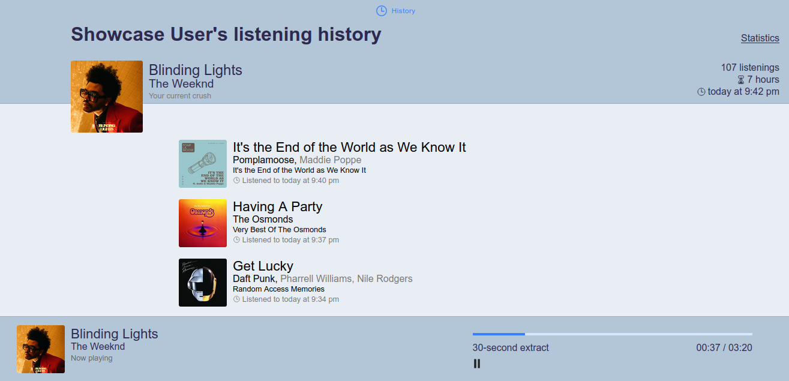

# Muzhistory

This web app retrieves your listening history from the Deezer API and displays it neatly. You now have access to your entire listenign history ! You can also see the artists, albums and tracks you listened to the most during the past week, month or year.

**The website is available: [Muzhistory](https://muzhistory.eu.pythonanywhere.com)**

## Update plan
- New layout for the main page
- Year playlist
- Language statistics
- Spotify integration
- Music analysis

